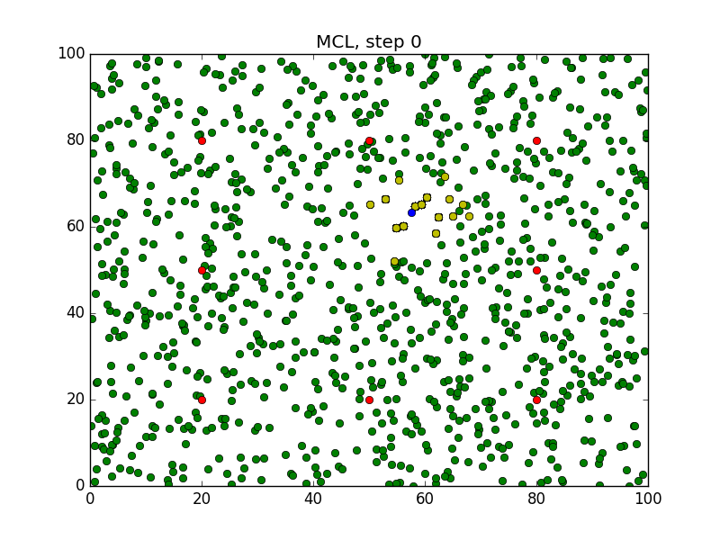
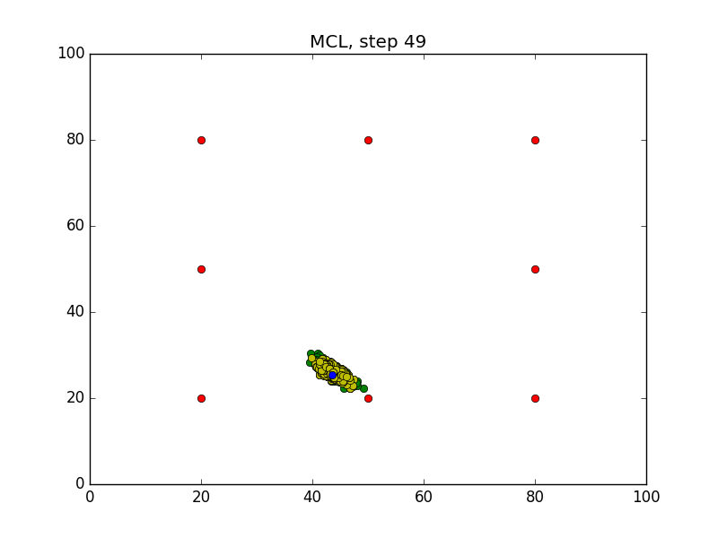

# MCL_Alogorithm_CPP

### Compiling the Program
```sh
$ cd /home/workspace/
$ git clone https://github.com/dil2743/MCL_Alogorithm_CPP
$ cd MCL_Alogorithm_CPP/
$ rm -rf Images/*
$ g++ main.cpp -o app -std=c++11 -I/usr/include/python2.7 -lpython2.7
```

### Running the Program
Before you run the program, make sure the `Images` folder is empty!
```sh
$ ./app
```
Wait for the program to iterate `50` times.

### Generated Images
After running the program, `50` images will be generated in the `Images` folder.
#### Step0

#### Step49


